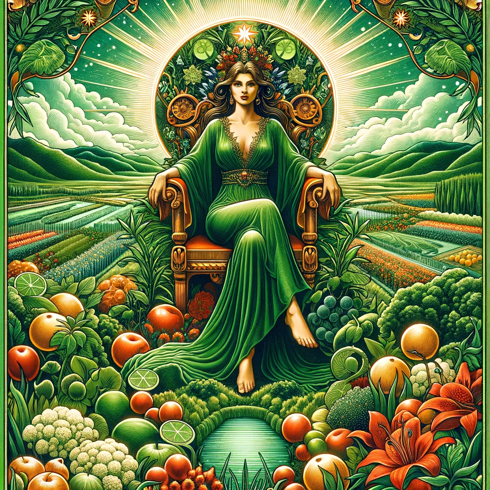
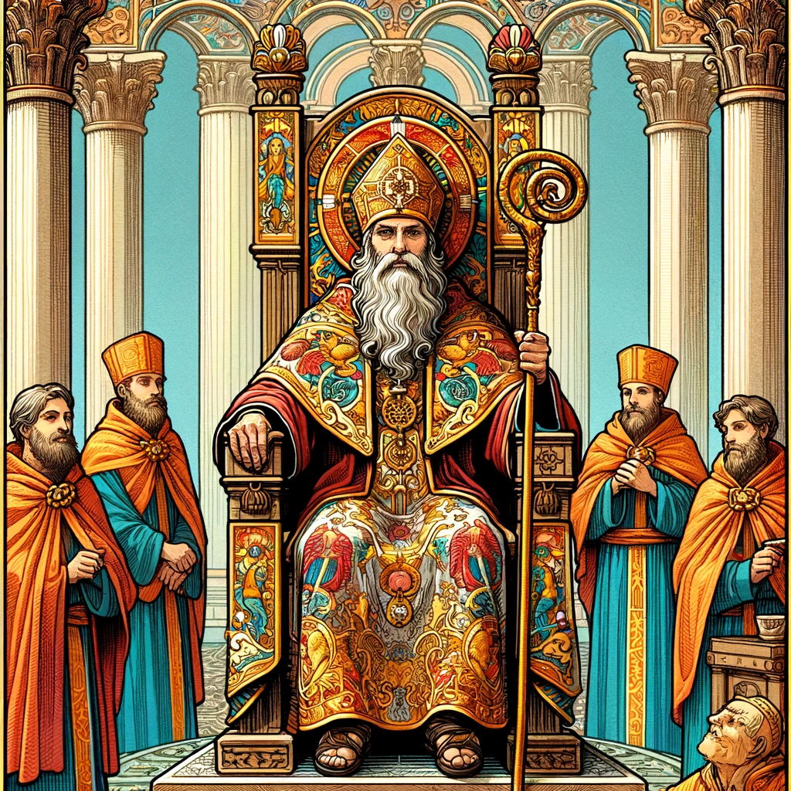

# DM-DF Taro

## Major Arcana (22 cards)
1. The Fool
2. The Magician
3. The High Priestess
4. The Empress
5. The Emperor
6. The Hierophant
7. The Lover
8. The Chariot
9. Strength
10. The Hermit
11. Wheel of Fortune
12. Justice
13. The Hanged Man
14. Death
15. Temperance
16. The Devil
17. The Tower
18. The Star
19. The Moon
20. The Sun
21. Judgement
22. The World

## Minor Arcana (56 cards)
- **Wands (14 cards)**: Ace through Ten, Page, Knight, Queen, King
- **Cups (14 cards)**: Ace through Ten, Page, Knight, Queen, King
- **Swords (14 cards)**: Ace through Ten, Page, Knight, Queen, King
- **Pentacles (14 cards)**: Ace through Ten, Page, Knight, Queen, King

